# 🗺️ JobGenie TDD Visual Roadmap - Sprint 2 & Sprint 3

## 📊 **Executive Dashboard - Single Source of Truth**

```mermaid
gantt
    title JobGenie Sprint 2 & 3 – TDD Implementation Roadmap
    dateFormat  YYYY-MM-DD
    axisFormat  %m/%d
    
    section Sprint 2 - AI Recruiter Platform
    🔴 RED Phase - Failing Tests        :crit, red2, 2025-01-20, 2d
    🟢 GREEN Phase - AI Implementation  :green2, after red2, 5d
    🔵 REFACTOR - Performance & Cost    :blue2, after green2, 2d
    🧪 Integration Testing             :test2, after blue2, 1d
    📊 Performance Validation          :perf2, after test2, 1d
    
    section Sprint 3 - Candidate Experience
    🔴 RED Phase - Failing Tests        :crit, red3, 2025-01-29, 2d
    🟢 GREEN Phase - Feature Implementation :green3, after red3, 7d
    🔵 REFACTOR - UI/UX & Optimization :blue3, after green3, 3d
    ♿ Accessibility & Compliance      :a11y3, after blue3, 1d
    🧪 Integration Testing             :test3, after a11y3, 1d
    
    section Production Readiness
    🚀 Deployment Preparation          :deploy, after test3, 2d
    📈 Monitoring & Analytics Setup    :monitor, after deploy, 1d
    🎉 Production Launch               :milestone, launch, after monitor, 1d
```



---

## 🎯 **Sprint Milestone Overview**

### **📅 Timeline at a Glance**
- **Sprint 2 Duration**: 11 days (Jan 20 - Jan 30)
- **Sprint 3 Duration**: 14 days (Jan 29 - Feb 11) 
- **Total Implementation**: 3 weeks with 2-day overlap
- **Production Launch**: February 12, 2025

### **🏆 Success Metrics Dashboard**
| Sprint | Feature | Test Coverage | Performance Target | Business Impact |
|--------|---------|---------------|-------------------|-----------------|
| **Sprint 2** | AI Recruiter | 100% (15 tests) | <5s semantic search | +40% recruiter efficiency |
| **Sprint 3** | Candidate UX | 100% (90+ tests) | <10s Smart Apply | +25% application conversion |

---

## 🔴 **RED PHASE - Test-First Development**

### **Current Status: ✅ COMPLETE**

```mermaid
graph TD
    A[🔴 RED Phase Status] --> B[Sprint 2: RecruiterAI]
    A --> C[Sprint 3: Candidate Experience]
    
    B --> B1[✅ 15 Failing Tests Created]
    B --> B2[✅ Semantic Search Tests]
    B --> B3[✅ AI Summary Tests]
    B --> B4[✅ Match Scoring Tests]
    B --> B5[✅ Performance Benchmarks]
    
    C --> C1[✅ 25 SmartApply Tests]
    C --> C2[✅ 30 Assessment Tests]
    C --> C3[✅ 35 Interview Tests]
    C --> C4[✅ Analytics & Security Tests]
    
    style A fill:#ff6b6b
    style B1 fill:#51cf66
    style C1 fill:#51cf66
```



#### **✅ RED Phase Deliverables - COMPLETE**
- **RecruiterAIService.test.ts**: 15 comprehensive failing tests
- **SmartApplyService.test.ts**: 25 comprehensive failing tests
- **AssessmentService.test.ts**: 30 comprehensive failing tests
- **InterviewSimulatorService.test.ts**: 35 comprehensive failing tests

**Total TDD Tests Created**: **105 failing tests** defining exact behavior

---

## 🟢 **GREEN PHASE - Implementation Roadmap**

### **Sprint 2: AI Recruiter Platform (5 days)**


#### **🎯 Sprint 2 Implementation Checklist**
- [ ] **OpenAI Service Integration** (GPT-4 + embeddings)
- [ ] **Pinecone Vector Database** setup and indexing
- [ ] **Semantic Candidate Search** with <5s response time
- [ ] **AI Candidate Summaries** with structured feedback
- [ ] **Advanced Match Scoring** with explainable reasoning
- [ ] **Recruiter Chatbot** for search assistance
- [ ] **Rate Limiting & Cost Controls** implementation
- [ ] **Comprehensive Error Handling** for all failure modes

### **Sprint 3: Candidate Experience Platform (7 days)**


#### **🎯 Sprint 3 Implementation Checklist**
- [ ] **Smart Apply Service** with AI-generated cover letters
- [ ] **Resume Bullet Optimization** with job-specific tailoring
- [ ] **Assessment System** with 3+ micro-assessments
- [ ] **Auto-Grading Engine** with instant results
- [ ] **Digital Badge System** with verification codes
- [ ] **Interview Simulator** with 10-question sessions
- [ ] **Real-time AI Feedback** with actionable tips
- [ ] **Notification System** (in-app + email)
- [ ] **Analytics Instrumentation** for conversion tracking

---

## 🔵 **REFACTOR PHASE - Production Optimization**

### **Code Quality & Performance Targets**


#### **🎯 REFACTOR Phase Deliverables**
- **Performance Benchmarks**: All response times under targets
- **Code Quality**: Clean, maintainable, well-documented code
- **Security Compliance**: GDPR, content safety, input validation
- **Cost Optimization**: Intelligent caching and request optimization
- **Accessibility**: WCAG 2.1 AA compliance for all UI components
- **Monitoring**: Comprehensive analytics and error tracking

---

## 📊 **Test Coverage & Quality Metrics**

### **Current Test Status Dashboard**

```mermaid
pie title Test Coverage Distribution
    "✅ Passing Core Tests" : 94
    "🔴 RED Phase Tests (Expected Fail)" : 105
    "⏳ Pending Implementation" : 0
```



#### **📈 Quality Metrics Targets**
| Metric | Current | Sprint 2 Target | Sprint 3 Target |
|--------|---------|----------------|-----------------|
| **Test Coverage** | 100% core | 100% AI services | 100% candidate features |
| **Performance** | <15s test suite | <5s semantic search | <10s Smart Apply |
| **Type Safety** | 100% | 100% | 100% |
| **Error Handling** | Comprehensive | AI-specific errors | User-facing errors |

---

## 🚀 **Implementation Strategy & Team Coordination**

### **Development Workflow**

```mermaid
flowchart TD
    A[🔴 RED: Failing Tests] --> B{All Tests Fail Correctly?}
    B -->|Yes| C[🟢 GREEN: Implement Features]
    B -->|No| A
    
    C --> D{All Tests Pass?}
    D -->|Yes| E[🔵 REFACTOR: Optimize Code]
    D -->|No| C
    
    E --> F{Performance Targets Met?}
    F -->|Yes| G[✅ Feature Complete]
    F -->|No| E
    
    G --> H[🧪 Integration Testing]
    H --> I[📊 Performance Validation]
    I --> J[🚀 Production Deployment]
    
    style A fill:#ff6b6b
    style C fill:#51cf66
    style E fill:#339af0
    style G fill:#69db7c
```



### **Team Responsibilities Matrix**

| Role | Sprint 2 Focus | Sprint 3 Focus | Success Criteria |
|------|----------------|----------------|------------------|
| **Backend Dev** | AI service implementation | API integration | All tests GREEN |
| **Frontend Dev** | Admin UI for recruiters | Candidate UX features | Conversion targets met |
| **DevOps** | AI infrastructure setup | Performance monitoring | <5s response times |
| **QA** | Test automation | Accessibility testing | 100% test coverage |
| **PM** | Feature validation | User acceptance testing | Business metrics achieved |

---

## 🎯 **Business Impact & Success Metrics**

### **Revenue Impact Projections**


### **🎯 Key Performance Indicators (KPIs)**

#### **Sprint 2 - AI Recruiter Success Metrics**
- **Semantic Search Performance**: <5s response time ✅
- **AI Summary Quality**: >80% recruiter satisfaction
- **Cost Efficiency**: <$0.50 per candidate search
- **Match Accuracy**: >90% relevance score
- **Adoption Rate**: >60% of recruiters use AI features

#### **Sprint 3 - Candidate Experience Success Metrics**
- **Smart Apply Conversion**: ≥25% start-to-submit rate
- **Assessment Completion**: ≥40% completion rate
- **Interview Satisfaction**: ≥70% thumbs up rating
- **Feature Adoption**: >50% of candidates use ≥1 feature
- **Application Quality**: 2x response rate vs manual applications

---

## 📋 **Risk Mitigation & Contingency Plans**

### **Technical Risks & Mitigation**

| Risk | Probability | Impact | Mitigation Strategy |
|------|-------------|--------|-------------------|
| **OpenAI API Rate Limits** | Medium | High | Implement intelligent caching + backup LLM |
| **Pinecone Performance** | Low | High | Local vector storage fallback |
| **Cost Overruns** | Medium | Medium | Real-time cost monitoring + alerts |
| **Test Suite Performance** | Low | Low | Parallel test execution |

### **Business Risks & Mitigation**

| Risk | Probability | Impact | Mitigation Strategy |
|------|-------------|--------|-------------------|
| **User Adoption** | Medium | High | Comprehensive onboarding + value demonstration |
| **Competitor Response** | High | Medium | Focus on unique AI differentiation |
| **Regulatory Changes** | Low | High | GDPR compliance + content labeling |
| **Market Conditions** | Medium | Medium | Flexible pricing + feature flags |

---

## 🗓️ **Detailed Sprint Calendar**

### **Week 1: Sprint 2 - AI Recruiter Platform**
```
📅 January 20-24, 2025

Monday (1/20):    🔴 RED Phase Review + 🟢 GREEN Kickoff
Tuesday (1/21):   OpenAI + Pinecone Integration
Wednesday (1/22): Semantic Search Implementation  
Thursday (1/23):  Match Scoring + AI Summaries
Friday (1/24):    🔵 REFACTOR + Performance Testing
```

### **Week 2: Sprint 3 Prep + Implementation Start**
```
📅 January 27-31, 2025

Monday (1/27):    Sprint 2 Integration Testing
Tuesday (1/28):   Sprint 2 Performance Validation
Wednesday (1/29): 🔴 Sprint 3 RED Phase + 🟢 GREEN Start
Thursday (1/30):  Smart Apply Implementation
Friday (1/31):    Assessment System Development
```

### **Week 3: Sprint 3 - Candidate Experience**
```
📅 February 3-7, 2025

Monday (2/3):     Interview Simulator Implementation
Tuesday (2/4):    Notification System + Analytics
Wednesday (2/5):  🔵 REFACTOR Phase - UI/UX Optimization
Thursday (2/6):   Accessibility Testing + Compliance
Friday (2/7):     Integration Testing + Bug Fixes
```

### **Week 4: Production Readiness**
```
📅 February 10-12, 2025

Monday (2/10):    Deployment Preparation + Monitoring Setup
Tuesday (2/11):   Final Performance Validation + Security Review
Wednesday (2/12): 🚀 PRODUCTION LAUNCH! 🎉
```

---

## 📈 **Monitoring & Analytics Dashboard**

### **Real-Time Metrics to Track**

```mermaid
dashboard
    title JobGenie TDD Implementation Dashboard
    
    section Performance Metrics
    Semantic Search Response Time: 0:5s
    Smart Apply Generation Time: 0:10s
    Assessment Scoring Time: 0:5s
    Interview Feedback Time: 0:10s
    
    section Business Metrics  
    Recruiter AI Adoption: 0:60%
    Smart Apply Conversion: 0:25%
    Assessment Completion: 0:40%
    Interview Satisfaction: 0:70%
    
    section Technical Health
    Test Coverage: 100:100%
    API Error Rate: 0:1%
    Cost per Request: $0.10:$0.50
    System Uptime: 99.9:99.9%
```

### **📊 Success Tracking Framework**
- **Daily**: Performance metrics, error rates, cost tracking
- **Weekly**: Business KPIs, user adoption, feature usage
- **Sprint**: Test coverage, code quality, deployment readiness
- **Monthly**: Revenue impact, user satisfaction, competitive analysis

---

## 🎉 **Team Communication & Celebration Plan**

### **📢 Milestone Celebrations**
- **Sprint 2 Complete**: AI-powered recruiter platform launch party! 🤖
- **Sprint 3 Complete**: Candidate experience transformation celebration! 🎯
- **Production Launch**: Company-wide JobGenie 2.0 launch event! 🚀

### **🏆 Recognition Framework**
- **TDD Champions**: Developers who maintain 100% test coverage
- **Performance Heroes**: Team members who achieve <5s response times
- **User Experience Stars**: Contributors to >25% conversion improvements
- **Innovation Leaders**: Those who suggest valuable feature enhancements

---

**🗺️ TDD ROADMAP STATUS: COMPLETE AND ACTIONABLE!**

This comprehensive visual roadmap provides:
- **Clear Timeline**: 3-week implementation with daily milestones
- **Team Alignment**: Roles, responsibilities, and success criteria
- **Risk Management**: Proactive mitigation strategies
- **Success Metrics**: Measurable business and technical KPIs
- **Visual Progress Tracking**: Real-time dashboard monitoring

Ready for immediate team distribution and Jira/Notion integration! 🚀
